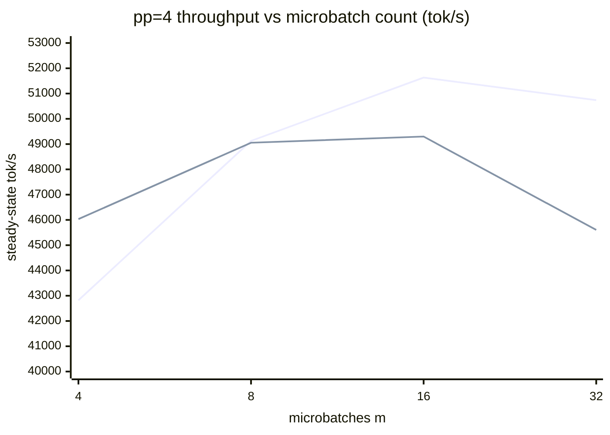

<div align="center">

# dstraining

**Tensor · Sequence · Pipeline · Data parallelism — written from scratch on raw collectives, benchmarked against Megatron-LM.**

[](#the-stack)
[](#the-stack)
[](#the-stack)
[](#correctness-as-a-first-class-feature)
[](#benchmarks-vs-megatron-lm)

*~3,500 lines. No DDP, no FSDP, no DeepSpeed, no `torch.distributed.pipelining`, no custom CUDA.*

**[Read the full write-up →](docs/WRITEUP.md)** — the complete build narrative, every bug, every number, and the $2.12 GPU bill.

</div>

---

Modern language models don't fit on one GPU, so training gets split across many.
There are only a handful of ways to split — each cuts along a different axis, and
each buys memory at the price of communication. This repo implements **all of
them** from first principles, proves every one numerically correct against a
single-process reference, composes them into one trainer, and races the result
against NVIDIA's Megatron-LM on identical hardware and identical kernels:

<div align="center">

| | pipeline (p=4) | data (d=2) | tensor (t=2) |
|---|:---:|:---:|:---:|
| **dstraining** | **51.6k tok/s** | **75.4k tok/s** | 41.3k tok/s |
| Megatron-LM | 37.7k tok/s | 64.9k tok/s | 43.6k tok/s |
| | **+37%** | **+16%** | −5% (see [benchmarks](#benchmarks-vs-megatron-lm)) |

</div>

> **What "from scratch" means here.** Every collective call and all of the
> parallelism logic is written in this repo. The allowed primitives are
> autograd, `torch.matmul`/cuBLAS, and raw NCCL/gloo collectives via
> `torch.distributed`. Not used: `DistributedDataParallel`, FSDP,
> `torch.distributed.pipelining`, DeepSpeed, Megatron, or any parallelism
> library. No custom CUDA — the matmuls are cuBLAS and the collectives are
> NCCL; a kernel would expand surface area without adding insight.

## How a batch flows

Eight ranks running everything at once — `rank = pp·(tp·dp) + dp·tp + tp_rank`,
TP innermost so its bandwidth-hungry all-reduces stay node-local:

```
                     ┌────────────────  pipeline stage 0  ───────────────┐   ┌───── stage 1 ─────┐
                     │  embed → blocks 0..7 (each: TP attn + TP MLP,     │   │  blocks 8..15     │
   batch ── split ──▶│  activations sequence-sharded between them)       │──▶│  → ln_f → head    │──▶ loss
        │            │                                                   │p2p│  vocab-parallel CE│
        │            │   rank 0 ◀──f/f̄·g/ḡ──▶ rank 1     (TP pair)      │   │   rank 4 ◀─▶ 5    │
        │            └───────────────────────────────────────────────────┘   └───────────────────┘
        │            ┌───────────────────────────────────────────────────┐   ┌───────────────────┐
        └── split ──▶│   rank 2 ◀────────────▶ rank 3     (DP replica 2) │──▶│   rank 6 ◀─▶ 7    │──▶ loss
                     └───────────────────────────────────────────────────┘   └───────────────────┘
                                  ▲ gradients all-reduced across DP replicas, bucketed,
                                    overlapped with backward ▲
```

## What's implemented

| axis | the mechanism | where |
|---|---|---|
| ✅ **Tensor parallelism** | column/row-split matmuls on the conjugate pair *f* (identity fwd / all-reduce bwd) and *f̄* (all-reduce fwd / identity bwd); attention split by heads, fused qkv | [`dst/ops.py`](dst/ops.py) · [`dst/layers.py`](dst/layers.py) |
| ✅ **Sequence parallelism** | LayerNorm/dropout/residual regions sharded along seq via *g*/*ḡ* (all-gather ⇄ reduce-scatter); same bandwidth as TP's all-reduce, memory ÷ t for free | [`dst/ops.py`](dst/ops.py) |
| ✅ **1F1B pipeline** | layer-split stages, cross-process autograd via stashed (input, output) pairs, deadlock-free combined `batch_isend_irecv` per step | [`dst/pipeline.py`](dst/pipeline.py) |
| ✅ **Interleaved schedule** | v non-contiguous chunks per rank, ring p2p over per-(direction, chunk) communicator channels; bubble `(p−1)/m → (p−1)/(m·v)` | [`dst/pipeline.py`](dst/pipeline.py) |
| ✅ **Data parallelism** | bucketed grad all-reduce, launched by post-accumulate-grad hooks so comm overlaps backward — DDP's core rebuilt on raw collectives | [`dst/dp.py`](dst/dp.py) |
| ✅ **Selective recompute** | hand-materialized `s²·b·a` attention tensors discarded and rebuilt in backward by a 30-line custom autograd Function | [`dst/recompute.py`](dst/recompute.py) |
| ✅ **Vocab-parallel CE** | loss straight from vocab shards via three `[N]`-scalar all-reduces; the `[b,s,50304]` logit tensor never exists | [`dst/loss.py`](dst/loss.py) |
| ✅ **bf16 + fp32 masters** | updates applied in fp32, rounded once per step — the suite demonstrates plain-bf16 Adam stalling behind, live | [`dst/precision.py`](dst/precision.py) |

## Correctness as a first-class feature

The trick that makes everything testable: **initialization is invariant to the
parallel decomposition**. Sharded layers draw the *full* weight from a seeded
generator and keep their slice; every component seeds its own generator by
`(base_seed, component_id)`. So a model split any way — tp×pp×dp, interleaved,
sequence-parallel — holds *bit-identical* weights to a plain single-process
model, and every rank can build that reference locally and compare **losses,
every gradient shard, and multi-step Adam trajectories** with zero weight
copying. All five suites pass identically on CPU/gloo and GPU/NCCL:

```
conjugacy of f/f̄ and g/ḡ ✓   shard-vs-slice init ✓   forward + cross-rank identity ✓
every gradient vs reference ✓   Adam trajectory tracks reference ✓   loss falls ✓
LayerNorm regions really [B, T/t, C] ✓   in-flight microbatches ≤ warmup depth ✓
recompute drops exactly the predicted 2·s²·b·a bytes (saved_tensors_hooks) ✓
```

The suites caught real bugs: SP's partial gradients on replicated params (a
7e-2 error without the post-backward TP all-reduce), and an NCCL-only deadlock
gloo could never see (below).

## Benchmarks vs Megatron-LM

Same box, same model, same batch — and Megatron run with
`--transformer-impl local` (TransformerEngine and fused CUDA kernels off), so
both frameworks sit on **identical stock PyTorch kernels** and the comparison
isolates the parallelism plumbing. All numbers steady-state, warmup excluded.

**2× RTX 4090 (PCIe) · GPT-2 124M · bf16 + masters · selective recompute:**

| config | before perf pass | after perf pass | Megatron-LM |
|---|:---:|:---:|:---:|
| 1 GPU | 41.6k | 41.6k | — |
| dp=2 | 68.1k (1.64×) | **75.4k (1.81×)** | 64.9k (`--overlap-grad-reduce` on) |
| tp=2 | 23.7k | **41.3k** (+75%, with SP + vocab-parallel CE) | 43.6k (torch path can't do SP) |

The tp=2 column is the papers' NVLink argument, measured: PCIe can't feed TP's
per-layer all-reduces, so before the perf pass TP *lost* to a single GPU. Fused
qkv (one entry collective per attention, not three) and vocab-parallel CE (no
logit gather) recover parity; NVLink is what would turn it into a speedup.

**4× RTX 3090 · 16-layer GPT-2ish · the pipeline bubble, measured:**



Textbook shape: 1F1B climbs as the `(p−1)/m` bubble dies off; **interleaving
wins exactly at small m** (+7.5% at m=4, its bubble is `(p−1)/(m·v)`) and loses
at large m where the bubble is already tiny and v× more p2p messages dominate.
Megatron-LM, same box, same config, pp=4, m=16: **37.7k vs our 51.6k (+37%)**.
Composed tp2 × pp2 + SP + vocab-parallel CE: 26.5k tok/s.

**End-to-end proof it trains:** GPT-2 124M on a 30M-token FineWeb shard, loss
**10.99 → 6.24** over 600 steps at a sustained 75k tok/s
([full log](docs/gpu-run-2x4090-fineweb.log)). Total cloud spend for the entire
GPU phase — validation, training, perf work, benchmarks, across three boxes:
**$2.12**.

## The stack

| layer | choice | why |
|---|---|---|
| language / framework | Python 3.12 · PyTorch 2.8 (GPU) / 2.12 (dev) | autograd + cuBLAS matmuls are the allowed primitives |
| communication | raw `torch.distributed`: NCCL on GPU, gloo on CPU | identical code paths — all correctness work runs on a laptop |
| launcher | `torchrun` (GPU) · [`scripts/launch_local.sh`](scripts/launch_local.sh) (CPU, FileStore rendezvous) | macOS DNS hangs torchrun's TCP rendezvous; FileStore needs no sockets |
| model | GPT-2 architecture, written here (~300 lines) | small enough to verify, real enough to benchmark |
| precision | bf16 activations/grads, fp32 master weights + Adam state | bf16 needs no loss scaling; updates underflow without masters |
| data | memmapped uint16 token shards (FineWeb / OpenWebText via [`scripts/prepare_openwebtext.py`](scripts/prepare_openwebtext.py)), GPT-2 BPE via tiktoken | loss must fall to prove correctness; convergence isn't the point |
| baseline | [Megatron-LM](https://github.com/NVIDIA/Megatron-LM), `--transformer-impl local` | same-kernel comparison isolates the parallelism |
| infra | RunPod (2×4090, 4×3090), driven by `runpodctl` | rented by the hour; every result reproducible from the scripts |

## Quickstart

Everything below runs on a CPU-only laptop — that's the point of the gloo path.

```bash
git clone https://github.com/mohamadmsalman82/dstraining && cd dstraining
pip install torch numpy

# correctness suites (TP degree = process count; add --sp / --recompute / --vp)
scripts/launch_local.sh 2 tests/test_tp_correctness.py --sp --recompute --vp
scripts/launch_local.sh 4 tests/test_pp_correctness.py --pp 2 --tp 2 --chunks 2 --micro 1 --sp
scripts/launch_local.sh 8 tests/test_dp_correctness.py --dp 2 --pp 2 --tp 2 --chunks 2 --micro 1 --sp --bucketed
python3 tests/test_recompute.py
scripts/launch_local.sh 2 tests/test_precision.py

# train with every axis at once (on GPUs, use torchrun with the same flags)
scripts/launch_local.sh 8 train.py --dp 2 --tp 2 --pp 2 --chunks 2 \
    --sp --vp --recompute --bf16 --micro 2 --steps 40 --data synthetic
```

## How each axis works

<details>
<summary><b>Tensor parallelism — the conjugate operator pair</b></summary>

The MLP computes `Z = GeLU(X·A)·B`. Split `A` by columns so each rank computes
`GeLU(X·Aᵢ)` independently — GeLU is elementwise, a column split never mixes
entries. Split `B` by rows so `Z = Y₁B₁ + Y₂B₂`: one all-reduce. Attention
splits the same way, by heads — the fused qkv projection is column-parallel
with head-major rows (a column split hands each rank whole heads), the output
projection row-parallel.

Correctness comes from one pair of conjugate operators:

| | forward | backward |
|---|---|---|
| `f` | identity | all-reduce |
| `f̄` | all-reduce | identity |

Column-parallel layers apply `f` on the way in, row-parallel layers apply `f̄`
on the way out, and every gradient — including replicated params like
LayerNorms, which need no extra sync — comes out right with no other
bookkeeping. Communication per all-reduce scales as `b·s·h`: bandwidth-hungry,
belongs inside one node.
</details>

<details>
<summary><b>Sequence parallelism — the memory leak TP leaves behind</b></summary>

LayerNorm and dropout can't split along the hidden dimension, so under plain TP
every rank redundantly holds the full `b·s·h` activation there. SP shards those
regions along the sequence axis instead, swapping the pair for `g` (all-gather
seq fwd / reduce-scatter bwd) and `ḡ` (its conjugate). Since an all-reduce *is*
a reduce-scatter + an all-gather, total bandwidth is unchanged — the memory is
free: every per-layer activation term divides by t.

The one cost the conjugates don't cover: replicated params consuming
seq-sharded activations (LayerNorm weights, post-reduce-scatter biases) get
*partial* gradients — each rank only sees its chunk. `finalize_grads()`
all-reduces exactly those across the TP group; the suite fails 7e-2 without it.
</details>

<details>
<summary><b>Pipeline parallelism — 1F1B and the interleaved schedule</b></summary>

The model splits by layer into stages; autograd doesn't span processes, so each
stage stashes (input, output) pairs per in-flight microbatch, receives
`∂loss/∂output` from downstream, runs autograd locally, ships `∂loss/∂input`
upstream. 1F1B caps in-flight microbatches at `p − stage` regardless of m; each
step's sends and receives post as one `batch_isend_irecv`, which is what makes
the steady state deadlock-free. Bubble fraction: `(p−1)/m`.

Interleaving gives each rank v non-contiguous chunks — virtual stage
`k = c·p + r` on rank `k mod p` — so p2p becomes a ring and the bubble shrinks
to `(p−1)/(m·v)`, paid in v× more, v× smaller messages. The ring wrap puts
multiple identically-shaped streams on one rank pair and NCCL has no p2p tags,
so each (direction, chunk) gets its own process group as a channel.

Init is pp-invariant too: per-component seeded generators mean any stage draws
bit-identical weights to the full model.
</details>

<details>
<summary><b>Selective recompute — measured with saved_tensors_hooks</b></summary>

Core attention (`softmax(QKᵀ/√d)·V`) is written by hand and materializes the
`s×s` attention matrix the way pre-FlashAttention kernels do — deliberately,
because those `s²·b·a` tensors are what selective recompute exists to discard
(SDPA would never allocate them and there'd be nothing to measure).
`recompute()` is a custom autograd Function: no-grad forward saving only q/k/v,
re-run in backward. The test measures what autograd actually stashes:
4,210,688 bytes dropped vs 4,194,304 predicted by the `2·s²·b·a` term,
gradients bitwise identical.
</details>

<details>
<summary><b>Data parallelism — DDP's core on raw collectives</b></summary>

Grads group into ~25MB buckets in reverse parameter order (the order backward
produces them); each bucket flattens and all-reduces asynchronously the moment
its last gradient lands, via post-accumulate-grad hooks — communication
overlaps the rest of backward. Pipeline schedules accumulate over microbatches,
so they use the non-overlapped variant (buckets still pipeline against each
other). Measured worth: 1.64× → 1.81× on 2 GPUs.
</details>

<details>
<summary><b>Vocab-parallel cross-entropy — the logit gather you never do</b></summary>

With a column-parallel LM head, gathering logits materializes `[b, s, 50304]`
per rank — the largest activation in the model. Instead: local max +
all-reduce(MAX), local Σexp + all-reduce(SUM), and the target logit (each id
lives on exactly one rank) + all-reduce(SUM). Three `[N]`-scalar all-reduces
replace the gather; backward is local softmax-minus-onehot on this rank's
columns. Padded vocab columns mask to −inf and get zero gradient.
</details>

## Known limitation (found the honest way)

The interleaved schedule **deadlocks under NCCL when composed with tp/dp > 1**
— fine on gloo, fine on NCCL at tp=1, fully correctness-verified on CPU for
every composition. Diagnosis: the channels are multiple communicators, NCCL
requires ops across communicators in a globally consistent order, and with
tp > 1 the tp-collective and channel-p2p orders diverge across ranks while
unmatched p2p spin-kernels can starve the collectives. The fix is Megatron's
approach — per-step combined batched p2p with the full warmup/steady flag
machinery instead of fire-and-forget sends. Documented, not yet rebuilt: use
1F1B when composing pipeline with TP on NCCL.

Also learned at $4.72/hr: 8× MIG slices don't speak NCCL.

## Layout

```
dst/parallel.py    process groups and topology: TPContext, PPContext, DP groups
dst/ops.py         f/f̄ (TP), g/ḡ + scatter (SP), vocab gather — all collectives
dst/layers.py      ColumnParallelLinear, RowParallelLinear (init tp-invariant)
dst/model.py       GPT-2 from scratch: GPT, GPTStage, GPTChunks
dst/pipeline.py    1F1B and interleaved schedules, p2p exchange
dst/dp.py          bucketed + overlapped data-parallel grad reduction
dst/recompute.py   selective activation recompute (custom autograd Function)
dst/loss.py        vocab-parallel cross-entropy
dst/precision.py   bf16 + fp32 master weights
dst/data.py        memmapped token shards, deterministic batch draws
train.py           the trainer: every axis behind a flag
tests/             the five correctness suites
scripts/           launchers, data prep
```
